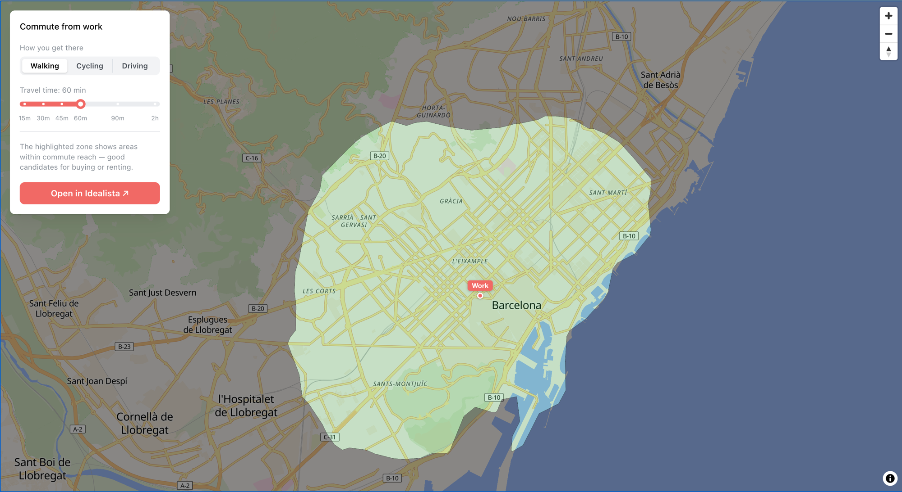

# BCN Property Finder

An interactive map that helps find property in Barcelona by filtering the city to areas within commute reach of your workplace.

**Live demo:** https://time2map.github.io/bcn-property-finder/



## How it works

1. Click anywhere on the map to set your workplace
2. Choose how you commute — Walking, Cycling, or Driving
3. Adjust the travel time (15 min – 2 hours)
4. The highlighted zone shows every neighbourhood reachable within that time
5. _(coming soon)_ Export the zone to Idealista to browse listings inside it

## Stack

| Layer | Technology |
|---|---|
| Frontend | React + Vite + TypeScript |
| Map | MapLibre GL JS + OpenFreeMap tiles |
| Isochrone | OpenRouteService API |
| Backend | Python + FastAPI (post-MVP) |

## Local development

```bash
cd frontend
cp .env.local.example .env.local   # add your ORS key
npm install
npm run dev
```

Get a free API key at [openrouteservice.org](https://openrouteservice.org).

```
# .env.local
VITE_ORS_API_KEY=your_key_here
```

## Commands

```bash
npm run dev        # dev server
npm test           # tests + coverage
npm run lint       # ESLint
npm run typecheck  # TypeScript
npm run build      # production build
```

## Docs

- [`docs/PROJECT_BRIEF.md`](docs/PROJECT_BRIEF.md) — product goals and MVP scope
- [`docs/ARCHITECTURE.md`](docs/ARCHITECTURE.md) — repository layout and key modules
- [`docs/DESIGN.md`](docs/DESIGN.md) — colour palette
