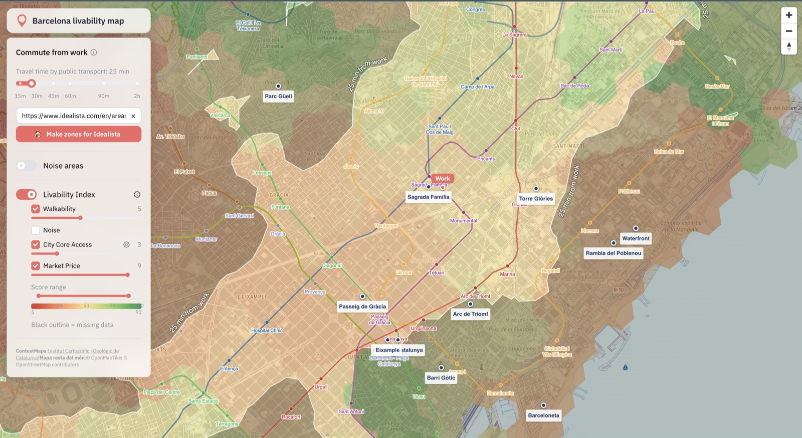

# Barcelona Livability Map

An interactive map for comparing places to live in Barcelona: commute isochrones, a weighted livability index (walkability, noise, city-core access, price) and side-by-side comparison of candidate apartments.

**Beta:** https://livability.time2map.com/



## Run locally

```bash
(cd backend && docker compose up -d)   # OTP2 routing, port 8080
cd frontend && cp .env.local.example .env.local && npm install && npm run dev
```

See [`docs/`](docs/) for product brief and architecture.
